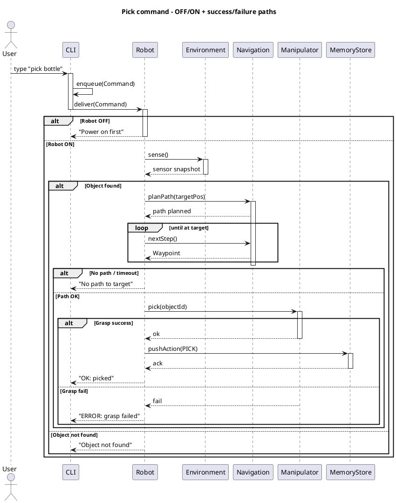

# System Design Proposal for Humanoid Robot Software

**Author**: Victor Angelier  
**Date**: August 2025

## Background Research

To design a software system for a humanoid robot, research was conducted using the keywords **“robot,” “human-robot interaction,”** and **“collaborative robot.”** These terms were selected to explore operational capabilities, user-facing interaction, and collaborative functionality in industrial settings (Mukherjee et al., 2022). “Robot” provided insights into core capabilities; “human-robot interaction” informed the CLI’s simplicity and feedback; “collaborative robot” emphasized safety and task-sharing (Ackerman, 2023). Additional references informed the design: Mulko (2023) illustrated practical humanoid applications; Siciliano and Khatib (2016) provided a framework for robotic subsystems; Russell and Norvig (2020) informed search and planning; and Thrun et al. (2005) guided environmental simulation. These sources underpin terminology choices and ensure the design aligns with contemporary practice.

## System Design Rationale

The proposed system equips a humanoid robot, operating as a warehouse assistant, with **navigation**, **object manipulation**, and **human communication**. These operations address essential tasks: moving to locations, handling items, and interacting with operators via a **command-line interface (CLI)** (Mukherjee et al., 2022). Python’s object orientation enables modularity and testability, with subsystem composition (`Robot` owns `Navigation`, `Manipulator`, `Communicator`, `Environment`, `MemoryStore`) promoting clear responsibilities (Sommerville, 2015).

**Why CLI?** In industrial contexts, a CLI is robust, scriptable, and auditable, supporting commands like `navigate 5,5`, `pick bottle`, and `speak hello` (Ackerman, 2023). **Power management** is modeled as a **state machine**, not a domain operation: `OFF → IDLE` via `powerOn()`, with a **CHARGING** state that returns **predictably to IDLE** when the battery reaches ≥95%. This gating prevents unsafe behavior and clarifies availability (Thrun et al., 2005).

**Data and algorithms.** `Environment` maintains **lists** of `EnvObject` and sensor readings with Gaussian noise and clipping, adequate for small scenes. `Navigation` maintains a **queue** of waypoints and computes routes using **A\*** on a 4-neighbor grid with a Manhattan heuristic (admissible and consistent), offering near-optimal runtime (~O(V log V + E)) relative to uninformed search (Russell and Norvig, 2020). `Manipulator` uses a **stack** for LIFO “undo” of grasp events, supporting recovery and traceability (Siciliano and Khatib, 2016).

**Trade-offs.** (1) A simple FIFO queue is retained for dispatching waypoints to the actuator; a priority queue could reorder steps but adds complexity without benefit once a path is fixed. (2) Linear search in `Environment` (O(n)) favors simplicity for small n; at scale, spatial indexing (grid hashing or k-d trees) would be preferable. (3) Modeling charging as a state that **always returns to IDLE** avoids surprise resumptions mid-task, which is safer for human-in-the-loop operation. (4) Interfaces (`IPlanner`, `ISensor`) enhance testability and future replacement (e.g., swapping A\* for D* Lite). Tests use `unittest` plus **property-based testing** (`hypothesis`) to verify invariants (stack LIFO, sensor bounds) and error paths (Derezińska, 2015; Kang et al., 2019).

## UML Models (PlantUML)

### Class Diagram (composition, stereotypes, cardinalities)
```plantuml
@startuml
skinparam classAttributeIconSize 0
package "Robot System" {
  class Waypoint <<value object>> { + x: Integer + y: Integer }
  class Command <<value object>> { + type: String + args: Map<String,String> }
  class EnvObject <<entity>> { + id: String + kind: String + position: Waypoint }
  enum RobotState { OFF IDLE MOVING MANIPULATING COMMUNICATING CHARGING ERROR }

  interface IPlanner { + planPath(start: Waypoint, target: Waypoint): void + nextStep(): Waypoint? }
  interface ISensor { + sense(): void }

  class Robot {
    - id: String
    - position: Waypoint
    - state: RobotState
    - batteryLevel: Integer
    + powerOn(): Boolean
    + powerOff(): Boolean
    + tick(command: Command): String
  }

  class Navigation { - pathQueue: Queue<Waypoint> + planPath(start: Waypoint, target: Waypoint): void + nextStep(): Waypoint? }
  class Manipulator { - graspHistory: Stack<String> + pick(objectId: String): Boolean + undoLastGrasp(): Boolean }
  class Communicator { + speak(text: String): void + display(text: String): void }
  class Environment { - objects: List<EnvObject> - sensorReadings: List<Float> + sense(): void + findNearestObject(kind: String): EnvObject? }
  class MemoryStore { - facts: List<String> - breadcrumbs: Stack<String> + pushAction(a: String): void + lastAction(): String? }
  class CLI { - cmdQueue: Queue<Command> + enqueue(cmd: Command): void + readCommand(): Command? }

  Navigation ..|> IPlanner
  Environment ..|> ISensor

  Robot "1" *-- "1" Navigation : nav
  Robot "1" *-- "1" Manipulator : manip
  Robot "1" *-- "1" Communicator : comms
  Robot "1" *-- "1" Environment : env
  Robot "1" *-- "1" MemoryStore : memory
  Environment "1" *-- "*" EnvObject : contains
  CLI --> Robot : sends Command
}
@enduml
```

### Activity Diagram (swimlanes, guards, exceptions)
```plantuml
@startuml
skinparam activity { BackgroundColor White; BorderColor Black }
skinparam shadowing false

partition "User" as U { start :Type "pick <objectKind>" in CLI; }
partition "CLI" as C { :Enqueue Command; }
partition "Robot" as R1 {
  :Read Command;
  if (state == OFF) then (yes)
    :Reply: "Power on first"; stop
  else (no) endif
  :Environment.sense();
}
partition "Environment" as E { :Collect sensor data; }
partition "Robot" as R2 {
  if (objectFound) then (yes)
    if (battery < 10%) then (yes) :Reply: "Low battery – please charge"; stop
    else (no) endif
  else (no) :Reply: "Object not found"; stop endif
}
partition "Navigation" as N { :planPath(targetPos); repeat :nextStep(); repeat while (not at object) }
partition "Robot" as R3 {
  if (no path or timeout) then (yes) :state = ERROR; :Notify: "No path to target"; stop
  else (no) :state = MANIPULATING; endif
}
partition "Manipulator" as M {
  :pick(objectId);
  if (graspSuccess) then (yes)
    :MemoryStore.pushAction(PICK);
    :state = IDLE; :Ack success to CLI; stop
  else (no) :state = ERROR; :Notify: "Grasp failed"; stop endif
}
@enduml
```

### Sequence Diagram (OFF/ON + success/failure paths)


### State Machine (charging → IDLE)
```plantuml
@startuml
title Robot State Machine with Low Battery & Charging
skinparam shadowing false
skinparam state { BackgroundColor White; BorderColor Black }

[*] --> OFF
OFF --> Operational : powerOn()
Operational --> OFF : powerOff()

state Operational {
  [*] --> IDLE
  state IDLE;  state MOVING;  state MANIPULATING;  state COMMUNICATING
  IDLE : entry / resetTimers()
  IDLE : exit  / recordIdleTime()
  MOVING : entry / startMotors()
  MOVING : exit  / stopMotors()
  MANIPULATING : entry / engageGripper()
  MANIPULATING : exit  / releaseGripper()
  COMMUNICATING : entry / openChannel()
  COMMUNICATING : exit  / closeChannel()
  IDLE --> MOVING : planPath()/step()
  MOVING --> IDLE : arrived()
  IDLE --> MANIPULATING : pick()/place()
  MANIPULATING --> IDLE : done()/cancel()
  IDLE --> COMMUNICATING : speak()/display()
  COMMUNICATING --> IDLE : done()
  MOVING --> ERROR : obstacle/fault
  MANIPULATING --> ERROR : graspFail
  COMMUNICATING --> ERROR : deviceFail
}
Operational --> CHARGING : [battery < 10%]
state CHARGING
CHARGING : entry / startCharging()
CHARGING : do    / charge()
CHARGING : exit  / stopCharging()
CHARGING --> IDLE : [battery >= 95%] / resumeOrIdle()
ERROR --> IDLE : recover()
ERROR --> OFF  : criticalFailure()
@enduml
```

## Data Structures

- **List**: `Environment.objects`, `Environment.sensorReadings` for scene and perception (linear search O(n) acceptable for small n).  
- **Stack**: `Manipulator.graspHistory`, `MemoryStore.breadcrumbs` for LIFO undo/trace.  
- **Queue**: `Navigation.pathQueue`, `CLI.cmdQueue` for FIFO path steps and command dispatch.

## Automated Testing Strategy

Testing uses Python’s `unittest` and **property-based testing** with **`hypothesis`**. Invariants are checked automatically (e.g., stack LIFO; sensor readings clipped to [0,1]). Error paths are covered (grasp failure, no path/timeout, low battery → charging), and navigation correctness is exercised through A\* path generation. Tests run via discovery:
```bash
python -m unittest -v
```
The repository includes `test_robot_system.py`; dependencies install via:
```bash
pip install -r requirements.txt
```

## Folder structure

```
OOP_PCOM7E_Assignment/
├── README.md
├── REPORT.md
├── robot_system.py
├── test_robot_system.py
└── uml/
    ├── class_diagram.puml
    ├── activity_diagram.puml
    ├── sequence_diagram.puml
    └── state_diagram.puml
└── assests/
    └── img/
      ├── activity_diagram.png
      ├── class_diagram.png
      ├── sequence_diagram.png
      ├── state_transition_diagram.png
      └── washingmachine_state_transition.png 


```

## References

- Ackerman, E. (2023) ‘Humanoid Robots Are Getting to Work’, *IEEE Spectrum*. Available at: https://spectrum.ieee.org/humanoid-robots (Accessed: 23 August 2025).
- Derezińska, A. (2015) ‘Improving mutation testing process of Python programs’, in *Software Engineering Techniques in Progress*, pp. 233–246.
- Kang, H.J., Lo, D. and Lawall, J. (2019) ‘BugsInPy: A database of existing bugs in Python programs to enable controlled testing and debugging studies’, in *Proceedings of the 33rd European Conference on Object-Oriented Programming*, pp. 1–6. doi:10.4230/LIPIcs.ECOOP.2019.1.
- Mukherjee, D. et al. (2022) ‘A Survey of Robot Learning Strategies for Human-Robot Collaboration in Industrial Settings’, *Robotics and Computer-Integrated Manufacturing*, 73, p. 102231. doi:10.1016/j.rcim.2021.102231.
- Mulko, M. (2023) ‘5 of the World’s Most Realistic Humanoid Robots Ever’, *Interesting Engineering*. Available at: https://interestingengineering.com/innovation/humanoid-robots (Accessed: 23 August 2025).
- Rumbaugh, J., Jacobson, I. and Booch, G. (2005) *The Unified Modeling Language Reference Manual*. 2nd edn. Addison-Wesley.
- Russell, S. and Norvig, P. (2020) *Artificial Intelligence: A Modern Approach*. 4th edn. Pearson.
- Siciliano, B. and Khatib, O. (2016) *Springer Handbook of Robotics*. 2nd edn. Springer.
- Sommerville, I. (2015) *Software Engineering*. 10th edn. Pearson.
- Thrun, S., Burgard, W. and Fox, D. (2005) *Probabilistic Robotics*. MIT Press.
