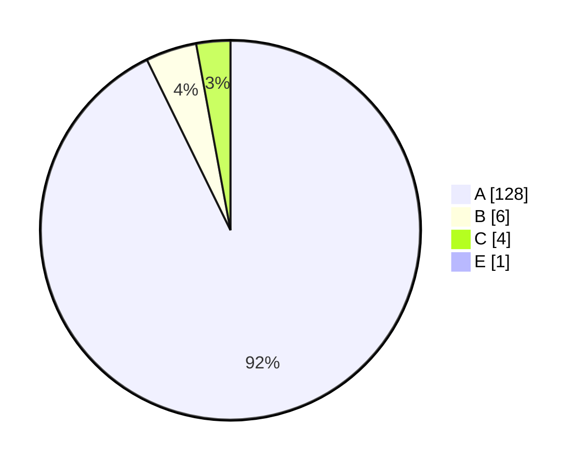

# Code Quality Report

**Generated:** 2025-10-04 14:14  
**Environment:** Python 3.12.4  
**Target:** `.`

## Executive Summary
- Cyclomatic Complexity blocks analysed: **139**  
- Maintainability Index (average): **77.8**  

## Cyclomatic Complexity — Rank Distribution


## Maintainability Index per file
| File | MI | Rank |
|---|---:|:---:|
| `__init__.py` | 100.0 | A |
| `__main__.py` | 53.5 | A |
| `app.py` | 92.8 | A |
| `domain\contracts.py` | 100.0 | A |
| `domain\models.py` | 100.0 | A |
| `robot_system.py` | 28.1 | A |
| `services\events.py` | 100.0 | A |
| `services\navigation.py` | 100.0 | A |
| `services\planning.py` | 100.0 | A |
| `tests\__init__.py` | 100.0 | A |
| `tests\conftest.py` | 100.0 | A |
| `tests\test_auto_charge.py` | 61.1 | A |
| `tests\test_branch_gaps.py` | 67.6 | A |
| `tests\test_charging_paths.py` | 67.5 | A |
| `tests\test_error_handling.py` | 85.4 | A |
| `tests\test_events.py` | 74.2 | A |
| `tests\test_navigation.py` | 64.4 | A |
| `tests\test_polymorphism.py` | 78.6 | A |
| `tests\test_robot_system.py` | 54.1 | A |
| `tests\test_robot_system_additionally.py` | 50.5 | A |
| `tests\test_robot_system_more.py` | 56.6 | A |

## Top 10 Complexity Hotspots
| Complexity | File | Line | Block |
|---:|---|---:|---|
| 38.0 | `robot_system.py` | 288 | `tick` |
| 14.0 | `robot_system.py` | 163 | `GreedyPlanner` |
| 13.0 | `robot_system.py` | 165 | `compute` |
| 12.0 | `tests\test_charging_paths.py` | 3 | `test_docking_to_charging_and_complete` |
| 11.0 | `robot_system.py` | 124 | `AStarPlanner` |
| 10.0 | `robot_system.py` | 125 | `compute` |
| 10.0 | `robot_system.py` | 243 | `Robot` |
| 10.0 | `__main__.py` | 3 | `main` |
| 9.0 | `tests\test_auto_charge.py` | 44 | `test_auto_charge_after_navigate_flow` |
| 7.0 | `tests\test_robot_system_more.py` | 20 | `test_power_on_off_returns_bool_and_state_changes` |

## Interpretation (for Unit 10)

Interpretation / Reflection (Unit 10). The analysis covers 139 blocks with an average cyclomatic complexity of 2.85 (A) and an average Maintainability Index (MI) of 77.8, indicating generally simple, testable code. The main hotspot is Robot.tick in robot_system.py (CC = 38, E-rank). Additional complexity points include GreedyPlanner (14) and GreedyPlanner.compute (13), plus moderate B-rank items such as AStarPlanner.compute (10), the Robot class (10), __main__.py:main (10) and Environment.find_nearest_object (6). Notably, robot_system.py shows a low MI (28.1) compared to other files. These results validate our architectural choices: Strategy (pluggable planners) and a lightweight Observer/EventBus keep decision density local and coupling low (McCabe, 1976; Gamma et al., 1995).
Refactor plan: (1) Apply a State/Command dispatch for Robot.tick (e.g., OffState, IdleState, NavigatingState, ChargingState), (2) introduce guard clauses and extract methods for charging/docking/error-recovery branches, (3) split GreedyPlanner.compute into pure helpers (candidates(), score(), select_best()), and (4) thin __main__.py:main by pushing logic into functions. Targets: remove the single E, reduce all C to B/A, and maintain MI ≥ 70 per file. We will re-run Radon in CI after each change to verify improvement. Overall, the metrics show our OO design supports maintainability and testability and positions the codebase for energy-aware optimisation in an IoT context.
  

## How to Reproduce
```bash
# from project root (contains 'robot' package)
py -m pip install radon
py tools/generate_quality_report.py robot
```

## References (Harvard)
- McCabe, T.J. (1976) ‘A complexity measure’, *IEEE TSE*, SE-2(4), pp. 308–320.
- Chidamber, S.R. and Kemerer, C.F. (1994) ‘A metrics suite for object-oriented design’, *IEEE TSE*, 20(6), pp. 476–493.
- Gamma, E. et al. (1995) *Design Patterns*. Addison-Wesley.
- Romano, F. and Kruger, H. (2021) *Learn Python Programming*. Packt.
