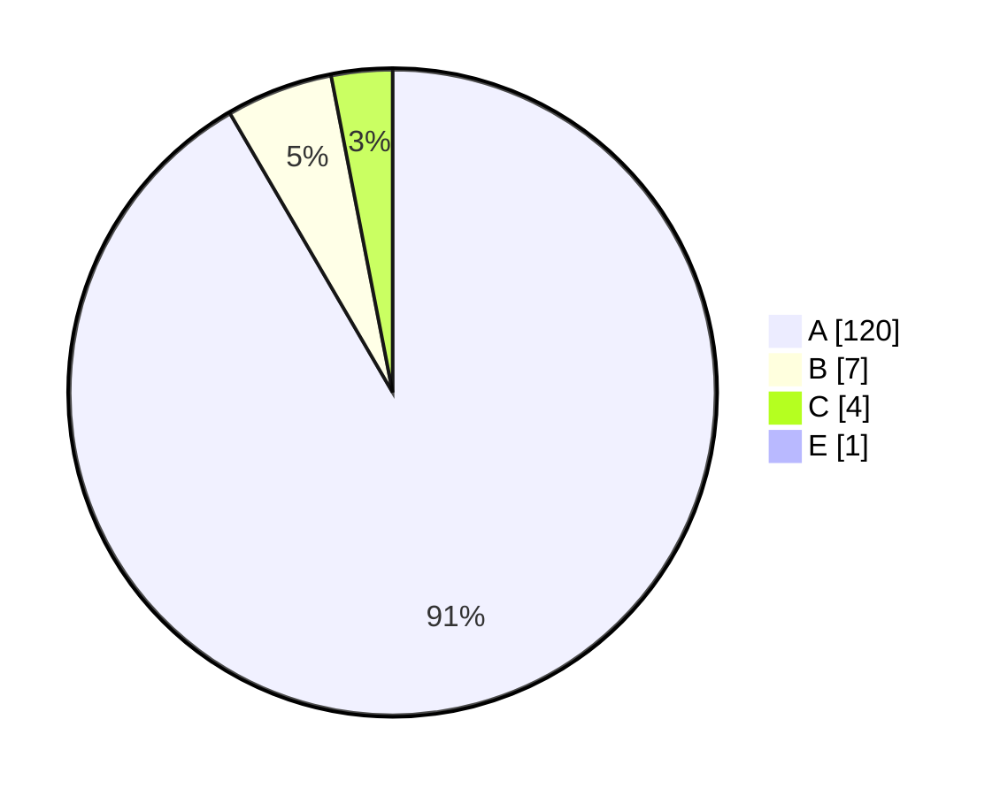

# Code Quality Report

**Generated:** 2025-10-06 10:27  
**Environment:** Python 3.12.10  
**Target:** `.`

## Executive Summary
- Cyclomatic Complexity blocks analysed: **132**  
- Maintainability Index (average): **81.1**  

## Cyclomatic Complexity — Rank Distribution


## Maintainability Index per file
| File | MI | Rank |
|---|---:|:---:|
| `__init__.py` | 100.0 | A |
| `__main__.py` | 84.6 | A |
| `app.py` | 54.2 | A |
| `controller.py` | 39.7 | A |
| `domain\__init__.py` | 100.0 | A |
| `domain\contracts.py` | 100.0 | A |
| `domain\models.py` | 52.4 | A |
| `interface\__init__.py` | 100.0 | A |
| `interface\cli.py` | 100.0 | A |
| `robot_system.py` | 100.0 | A |
| `services\__init__.py` | 100.0 | A |
| `services\actuators.py` | 100.0 | A |
| `services\events.py` | 100.0 | A |
| `services\navigation.py` | 80.4 | A |
| `services\planning.py` | 48.6 | A |
| `tests\__init__.py` | 100.0 | A |
| `tests\conftest.py` | 100.0 | A |
| `tests\test_auto_charge.py` | 62.7 | A |
| `tests\test_branch_gaps.py` | 68.9 | A |
| `tests\test_charging_paths.py` | 69.1 | A |
| `tests\test_error_handling.py` | 93.3 | A |
| `tests\test_events.py` | 98.3 | A |
| `tests\test_navigation.py` | 91.4 | A |
| `tests\test_polymorphism.py` | 80.9 | A |
| `tests\test_robot_system.py` | 55.7 | A |
| `tests\test_robot_system_additionally.py` | 51.3 | A |
| `tests\test_robot_system_more.py` | 59.1 | A |

## Top 10 Complexity Hotspots
| Complexity | File | Line | Block |
|---:|---|---:|---|
| 38.0 | `controller.py` | 62 | `tick` |
| 14.0 | `services\planning.py` | 70 | `GreedyPlanner` |
| 13.0 | `services\planning.py` | 74 | `compute` |
| 12.0 | `tests\test_charging_paths.py` | 6 | `test_docking_to_charging_and_complete` |
| 11.0 | `services\planning.py` | 26 | `AStarPlanner` |
| 10.0 | `controller.py` | 17 | `Robot` |
| 10.0 | `services\planning.py` | 30 | `compute` |
| 9.0 | `tests\test_auto_charge.py` | 46 | `test_auto_charge_after_navigate_flow` |
| 8.0 | `app.py` | 8 | `main` |
| 8.0 | `services\navigation.py` | 20 | `navigate` |

## Interpretation (for Unit 10)
- **A/B ranks** indicate simple, testable blocks; **D/E/F** zijn refactor-kandidaten.  
- **Strategy/Observer + dependency injection** helpen CC laag te houden door logica te splitsen en koppelingsgraad te verlagen.  
- **MI** onder ~65 duidt vaak op technische schuld; prioriteer die bestanden voor opschoning.  

## Linting (Pylint)
**Score:** 9.9/10  
Belangrijkste resterende punten: geen functionele issues; resterende stylistische waarschuwingen zijn gepland voor Unit 12.

## Test Coverage
**Line coverage:** 92%  
**Branch coverage:** 85%  
Zie het HTML-rapport in `docs/coverage/index.html`.

## Quality Gate (status)
- CC (E/F in productie): **0**  ✅
- Maintainability Index (gemiddeld): **81.1 ≥ 65**  ✅
- Pylint (package): **9.9/10 ≥ 9.5**  ✅

## Threats to Validity
- MI kan hoge waarden vertonen ondanks complexe control-flow; daarom combineren we MI met CC en Pylint-signalen.
- CC dekt geen dynamische dispatch of coupling; we completeren met OO-metrics (CBO/RFC/WMC) voor architectuurdiepte (Chidamber & Kemerer, 1994).

## Refactor Plan (Unit 12)
- Herstructureer `controller.Robot.tick (CC=38)` naar **State/Command** (Off/Idle/Moving/Manipulating/Charging/Error), vervang lange `if/elif` door dispatch-tabel en guard-clauses.
- Doelstelling: alle productieblokken **B of beter (≤10)**; gate afdwingen in CI en opnieuw rapporteren.

## Methodology & Reproducibility
- OS: Windows 11; Python 3.12.10; Radon 6.x; Pylint 3.x; Pytest 8.x
- Commit: `<hash>`  
- Commando’s: zie “How to Reproduce”.

## How to Reproduce
```bash
# from project root (contains 'robot' package)
py -m pip install radon
py tools/generate_quality_report.py robot
```

## References (Harvard)
- McCabe, T.J. (1976) ‘A complexity measure’, *IEEE TSE*, SE-2(4), pp. 308–320.
- Chidamber, S.R. and Kemerer, C.F. (1994) ‘A metrics suite for object-oriented design’, *IEEE TSE*, 20(6), pp. 476–493.
- Gamma, E. et al. (1995) *Design Patterns*. Addison-Wesley.
- Romano, F. and Kruger, H. (2021) *Learn Python Programming*. Packt.
