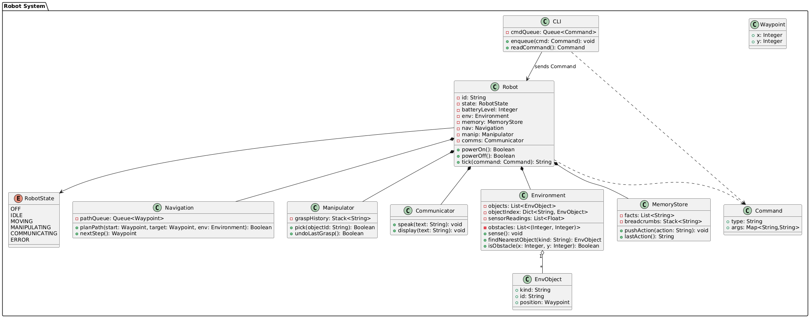
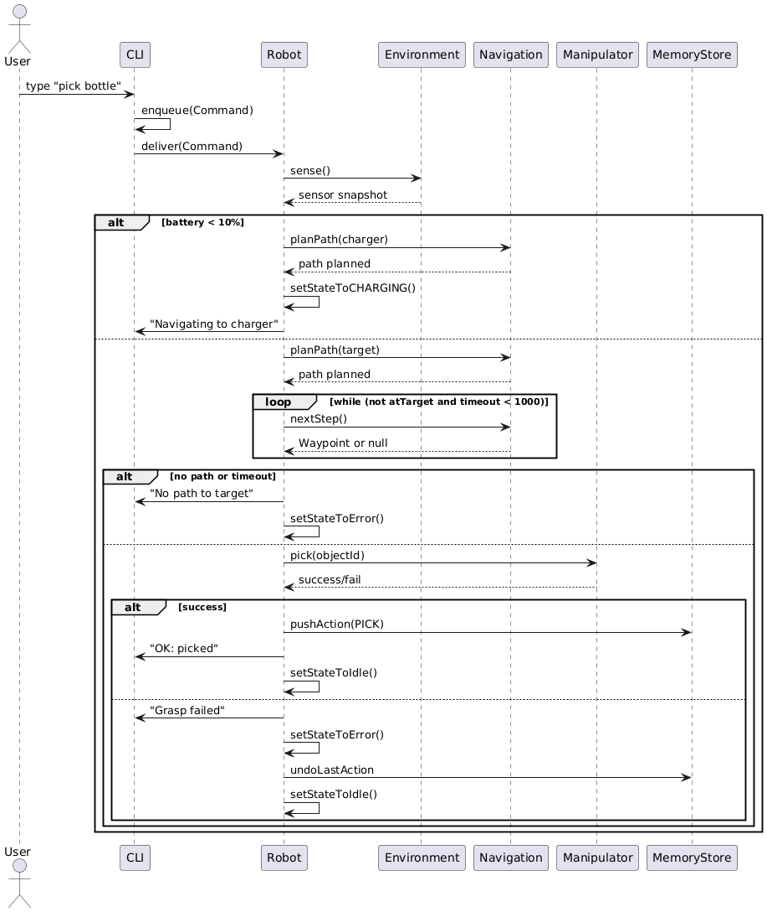
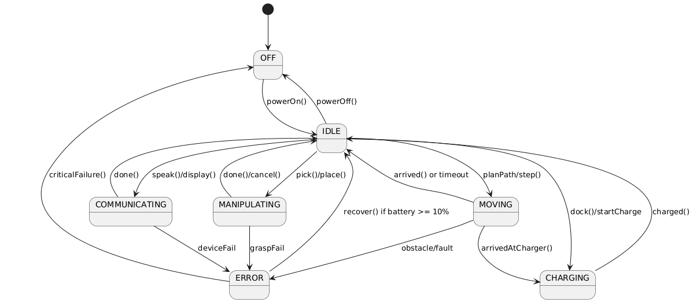
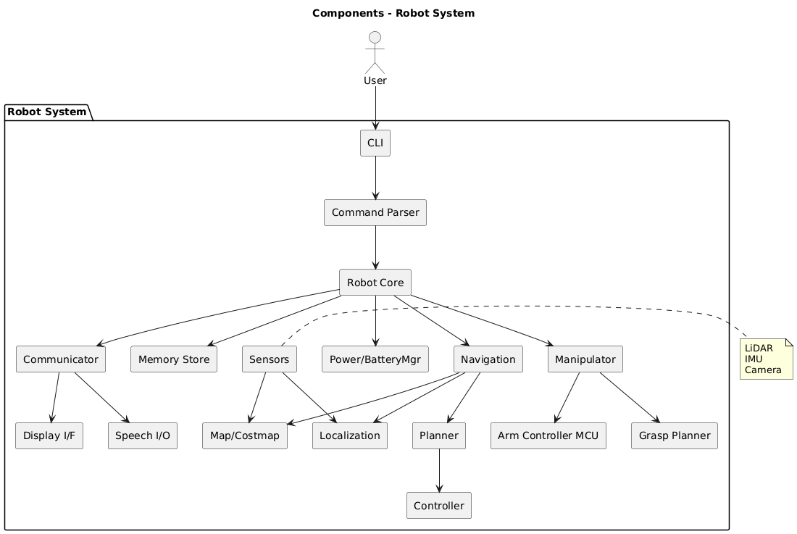
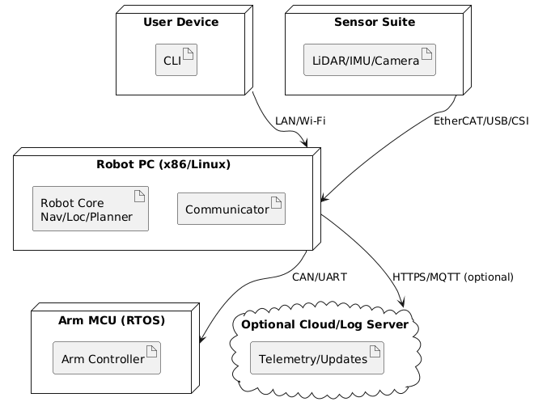
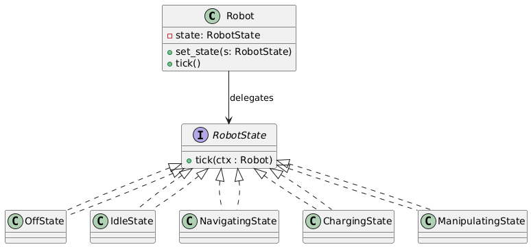

# MSc Computer Science – OOP_PCOM7E e-Portfolio
**Student:** Victor Angelier  **Module:** Object-Oriented Programming  
**Submission date:** 20 October 2025  **Word count:** ≈ 3 500 (+ evidence)

## Overview
This e-portfolio documents the design, implementation, and evaluation of the *Humanoid Robot* software system developed throughout Units 8–12.  
It demonstrates progressive learning outcomes across UML design, testing, packaging, and design-pattern application.

### Contents
1. [README – 600 word reflection](README.md)  
2. [REPORT – System Design Proposal (+ Rationale)](REPORT.md)  
3. [Design Rationale (extended)](Design_Rationale.md)  
4. [Code Quality Report (Unit 10 Testing in Practice)](Code_Quality_Report.md)  
5. [Final Reflection (Unit 12)](Reflection.md)

---

## UML Artefacts
*(unchanged from your current version)*  
- Class →   
- Sequence →   
- Activity → [Nav](assets/img/navigation_activity_diagram.png)
- Pick → [Pick](assets/img/activity-diagram-pickup.png) -> 
- Error → [Errors](assets/img/activity-diagram-errors.png)
- State →   
- Component →   
- Deployment →   
- State Pattern → 

---

## Run & Validate
```bash
python -m venv .venv && source .venv/bin/activate   # Windows: .venv\Scripts\activate
pip install -r requirements.txt
flake8
pytest -q --cov=robot --cov-report=term-missing
python -m robot
