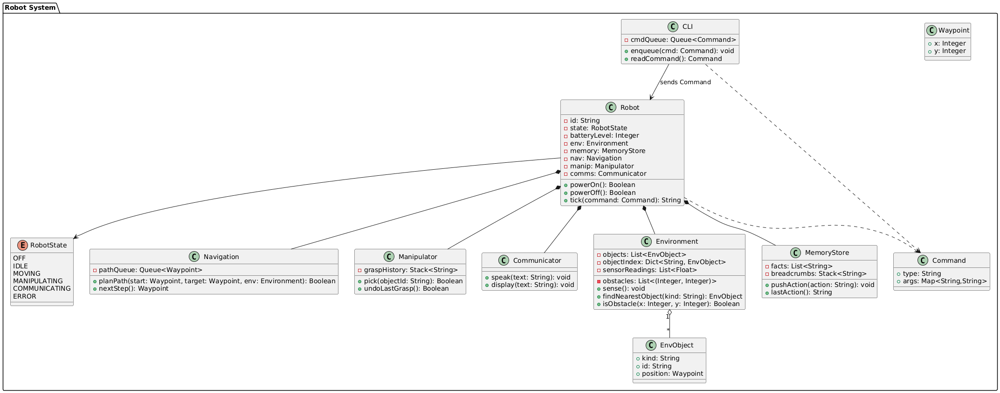
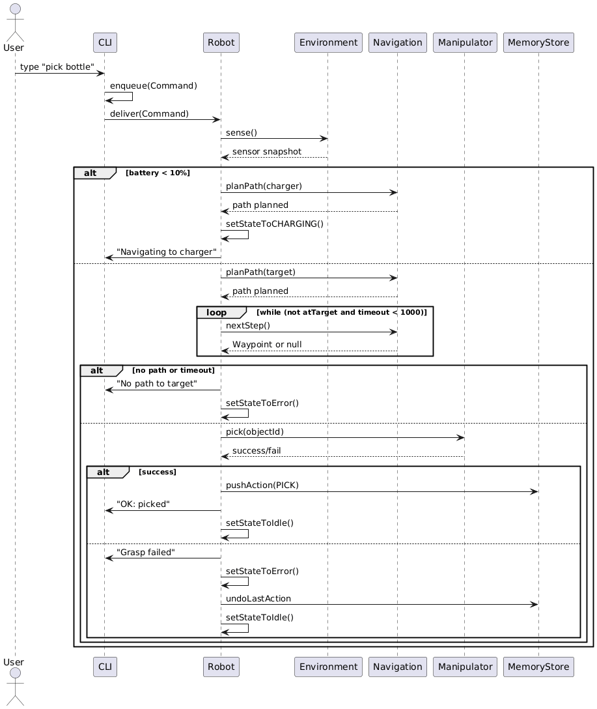

# System Design Proposal for Humanoid Robot Software

**Author**: Victor Angelier  
**Date**: 12 September 2025

---

## Background Research: Terms and Rationale

**robot, humanoid robot** — scope and capabilities for industrial tasks.  
**human-robot interaction (HRI)** — operator interaction via CLI and feedback.  
**collaborative robot (cobot)** — safety, task sharing, and guard conditions.  
**path planning, A*** — efficiency on obstacle grids and performance ceiling.  
**state machine, safety** — predictable recovery and testable guards.  
**manipulation and grasping** — grasp failure handling, undo, and operator feedback.

---

## Three Operations Supported

1. **Power management**: power on, power off, idle, explicit error recovery and auto-charging.  
2. **Navigation**: plan and execute a path to a target coordinate, with obstacle checks and timeouts.  
3. **Object manipulation**: find and pick an object kind, with success and failure feedback to the user.

These are exposed to the user through a front-end **command-line interface (CLI)**, for example `power on`, `navigate 3,5`, `pick bottle`.

---

## System Design Rationale (approx. 500 words, UK English)

The software in `robot/robot_system.py` supports navigation, object manipulation, and communication for a warehouse humanoid robot, accessed via `python -m robot`. It prioritises safety, maintainability, and testability, aligning with SDLC guidance (Sommerville, 2015). A composition-based architecture uses a `Robot` façade to orchestrate `Navigation`, `Manipulator`, `Communicator`, `Environment`, and `MemoryStore`, which reduces coupling and enables test-time substitution with stubs and fakes. This avoids inheritance hierarchies that often tighten coupling and blur responsibilities (Derezińska, 2015; Siciliano and Khatib, 2016).

The `RobotState` enum (`OFF`, `IDLE`, `MOVING`, `MANIPULATING`, `COMMUNICATING`, `CHARGING`, `ERROR`) encodes explicit transitions with guards. Commands are rejected while charging (except `tick` for progress), and a low-battery guard triggers auto-docking by planning a path to a charger and switching to `CHARGING` until full. This behaviour is validated by dedicated tests and reflected in the state diagram (`uml/state_diagram.puml`) (Mukherjee et al., 2022; Rumbaugh, Jacobson and Booch, 2005). Error paths are first-class: for example, no-path and grasp-failed cases set `ERROR` with clear operator messages and a deterministic route back to `IDLE` when safe.

Data structures are purpose-driven (Siciliano and Khatib, 2016). **Lists** hold dynamic elements (`Environment.objects`, `sensor_readings`) with constant-time append. A **dictionary** (`object_index`) provides O(1) lookups by ID, trading memory for speed during pick operations. **Stacks** (`Manipulator.grasp_history`, `MemoryStore.breadcrumbs`) support last-in, first-out undo and action tracing. **Queues** model FIFO progression for both path steps (`Navigation.path_queue`) and CLI commands, ensuring deterministic execution. These choices are simple to reason about and align directly with the UML activity and sequence diagrams.

Navigation uses A* with a Euclidean heuristic to balance performance and optimality; its expected time complexity is O(V log V + E), which is preferable to Dijkstra’s for large grids and to purely greedy approaches that sacrifice optimality (Russell and Norvig, 2020; Thrun, Burgard and Fox, 2005). Obstacle checks are encapsulated in `Environment.is_obstacle`, keeping the planner decoupled from the map representation. Polymorphism is explicit: `Navigation` depends on a `PathPlanner` Strategy; `AStarPlanner` is the default and `GreedyPlanner` an alternative. Tests inject planners and error stubs to demonstrate substitutability without modifying `Robot` (DIP and OCP in practice). Case-insensitive object lookup enhances CLI ergonomics, matching HRI expectations (Ackerman, 2023; Mulko, 2023).

**Critical analysis.** A* assumes a mostly static map; in dynamic settings D* Lite re-plans efficiently but increases complexity and test surface (Thrun, Burgard and Fox, 2005). In-memory lists, stacks, queues, and the dictionary are lightweight and adequate for the assignment but lack durability and provenance guarantees (Sommerville, 2015). The CLI yields determinism and simplicity compared with a ROS-based GUI, at the cost of interactivity and richer visual feedback (Ackerman, 2023). An event-driven supervisor could overlap sensing and motion to reduce latency. For very large or changing spaces, PRM and RRT methods are relevant for manipulation, trading exact optimality for probabilistic completeness (Russell and Norvig, 2020).

For concrete traceability, PlantUML sources reside under `uml/` — `uml/class_diagram.puml`, `uml/activity_navigate.puml`, `uml/activity_pick.puml`, `uml/activity_errors.puml`, `uml/sequence_diagram.puml`, and `uml/state_diagram.puml` — and map one-to-one to the entries in the traceability matrix.

---

## UML Artefacts (embedded)

> The four required diagrams are embedded below; additional diagrams are included for completeness.

**Figure 1 — Class Diagram.** Structure (Robot orchestrates Navigation, Manipulator, Communicator, Environment, Memory) and key attributes and operations; corresponds to `robot_system.py`.  

**Figure 2 — Activity (Navigate).** Guards for OFF, low battery, no-path or timeout; loop over `nextStep`; maps to `Robot.tick` for navigate.  

**Figure 3 — Sequence.** CLI to Robot to Environment, Navigation, Manipulator, Memory with alternative error branches; mirrors tests.  

**Figure 4 — State Diagram.** OFF to IDLE, IDLE to MOVING or MANIPULATING or COMMUNICATING, CHARGING and ERROR; recovery to IDLE when safe.  

*(Optional additional diagrams if supplied: `assets/img/activity_pick.png`, `assets/img/activity_errors.png`, `assets/img/component_diagram.png`, `assets/img/deployment_diagram.png`, `assets/img/use_case_diagram.png`.)*

---

## Traceability Matrix

| Use case             | Sequence reference                 | Activity/State reference                   | Code evidence (examples)              |
|----------------------|------------------------------------|--------------------------------------------|---------------------------------------|
| Power and charge     | sequence_diagram (power branch)    | State `OFF → IDLE → CHARGING → IDLE`       | `Robot.power_on`, `Robot.tick('tick')` |
| Navigate to (x, y)   | sequence_diagram (navigate branch) | Activity “navigation”; `IDLE → MOVING`     | `Robot.tick('navigate')`, `Navigation` |
| Pick object          | sequence_diagram (pick branch)     | Activity “pick”; `IDLE → MANIPULATING`     | `Robot.tick('pick')`, `Manipulator`    |
| Handle errors        | error alt blocks                   | `ERROR` handling and recovery              | try or except and guards               |

---

## Data Structures and Search

- **List**: `Environment.objects`, `Environment.sensor_readings` (dynamic growth; audit and inspection).  
- **Dictionary**: `Environment.object_index` for O(1) ID lookups during pick.  
- **Stack**: `Manipulator.grasp_history`, `MemoryStore.breadcrumbs` for LIFO undo and tracing.  
- **Queue**: `Navigation.path_queue`, `CLI.cmd_queue` for FIFO execution.  
- **Search**: A* path planning with Euclidean heuristic; linear scans where simplicity is preferable.

---

## Evidence of Independent Working

**Result summary (latest run):** all tests passed; coverage approximately 95 percent for the `robot` package.  
**Repro steps:** create and activate a venv → `pip install -r requirements.txt` → `flake8` → `pytest -q --cov=robot --cov-report=term-missing` → `python -m robot`.

---

## References (Harvard)

- Ackerman, E. (2023) ‘Humanoid Robots Are Getting to Work’, *IEEE Spectrum*. Available at: https://spectrum.ieee.org/humanoid-robots (Accessed: 11 September 2025).
- Derezińska, A. (2015) ‘Improving mutation testing process of Python programs’, in *Software Engineering Techniques in Progress*, pp. 233–246.
- Kang, H.J., Lo, D. and Lawall, J. (2019) ‘BugsInPy: A database of existing bugs in Python programs to enable controlled testing and debugging studies’, in *Proceedings of the 33rd European Conference on Object-Oriented Programming*, pp. 1–6. doi:10.4230/LIPIcs.ECOOP.2019.1.
- Mukherjee, D. et al. (2022) ‘A Survey of Robot Learning Strategies for Human-Robot Collaboration in Industrial Settings’, *Robotics and Computer-Integrated Manufacturing*, 73, p. 102231. doi:10.1016/j.rcim.2021.102231.
- Mulko, M. (2023) ‘5 of the World’s Most Realistic Humanoid Robots Ever’, *Interesting Engineering*. Available at: https://interestingengineering.com/innovation/humanoid-robots (Accessed: 11 September 2025).
- Rumbaugh, J., Jacobson, I. and Booch, G. (2005) *The Unified Modeling Language Reference Manual*. 2nd edn. Addison-Wesley.
- Russell, S. and Norvig, P. (2020) *Artificial Intelligence: A Modern Approach*. 4th edn. Pearson.
- Siciliano, B. and Khatib, O. (eds) (2016) *Springer Handbook of Robotics*. 2nd edn. Springer.
- Sommerville, I. (2015) *Software Engineering*. 10th edn. Pearson.
- Thrun, S., Burgard, W. and Fox, D. (2005) *Probabilistic Robotics*. MIT Press.
