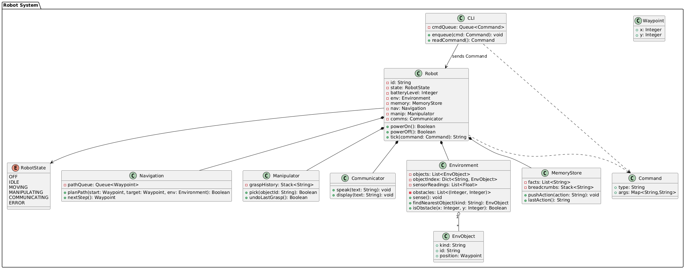
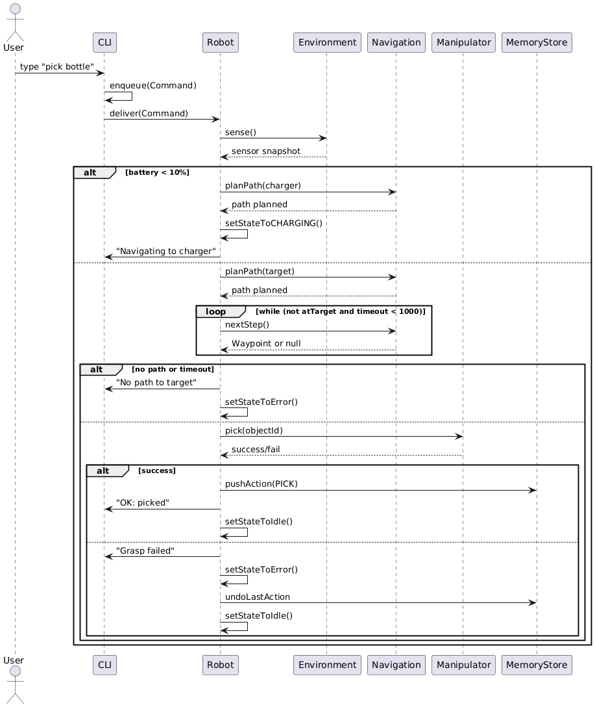
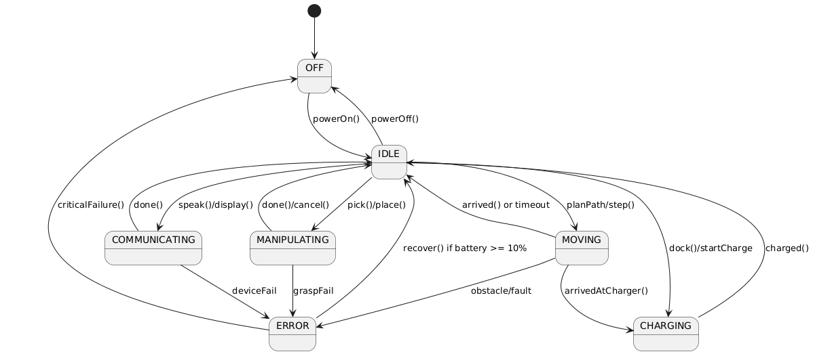
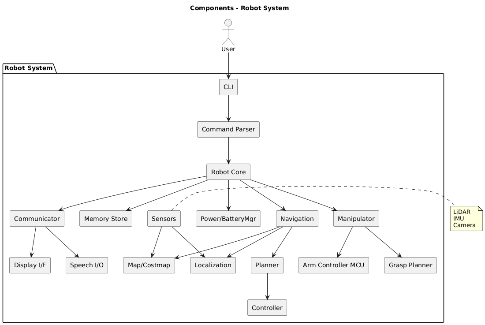
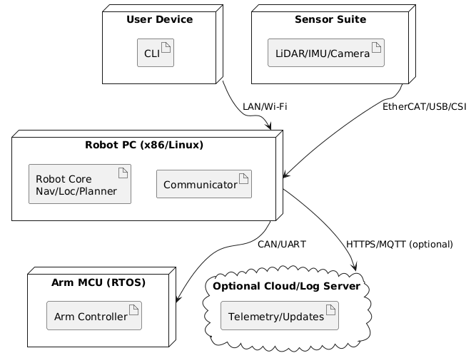
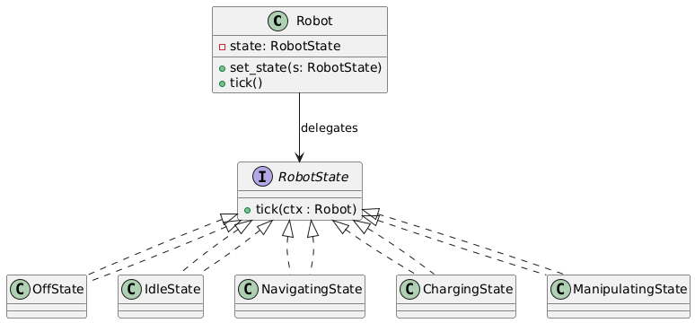

# Humanoid Robot – System Design

Welkom! Dit is de documentatie voor mijn OOP_PCOM7E-assignment.

- **Project README** → [README](README.md)
- **Summative Report (500w rationale incl.)** → [REPORT](REPORT.md)
- **Design Rationale (uitgebreid)** → [DESIGN_RATIONALE](DESIGN_RATIONALE.md)
- **Changelog** → [CHANGELOG](CHANGELOG.md)

## UML Artefacts
- Class → 
- Sequence → 
- Activity (navigate/pick/errors) → , , 
- State → 
- Component → 
- Deployment → 
- State Pattern → 

## Run & Validate
```bash
python -m venv .venv && source .venv/bin/activate   # Windows: .venv\Scripts\activate
pip install -r requirements.txt
flake8
pytest -q --cov=robot --cov-report=term-missing
python -m robot
